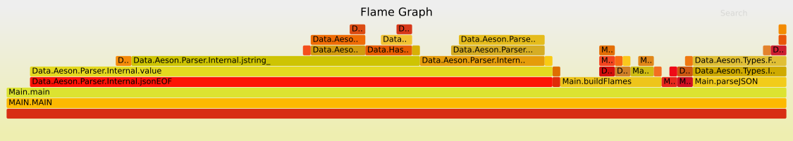

[](https://travis-ci.org/symbiont-io/prof-flamegraph)

Visualise Haskell application `.prof` data as a [flamegraph](http://www.brendangregg.com/flamegraphs.html).

For example



To install, use the `cabal-install` tool (get it from [`ghcup`](https://github.com/haskell/ghcup) or your operating system's package manager) and type

```
cabal new-update
cabal new-install prof-flamegraph
```

There is no need to clone this repository.

Further documentation in `prof-flamegraph.cabal` or with the `--help`.
